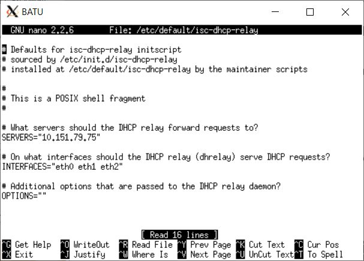
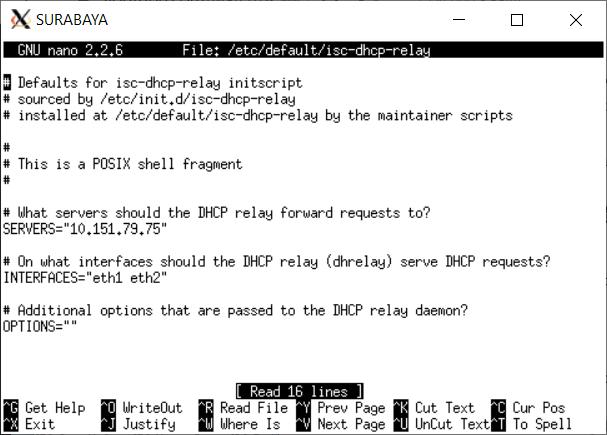
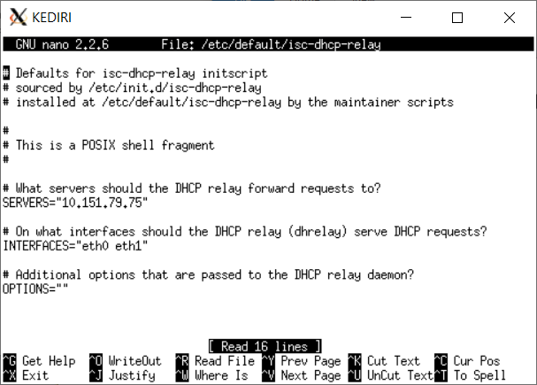
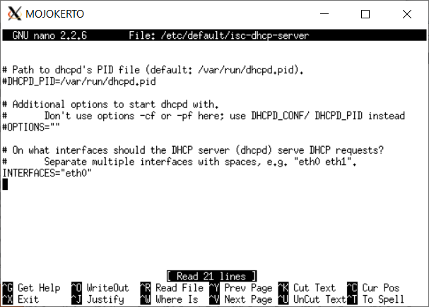
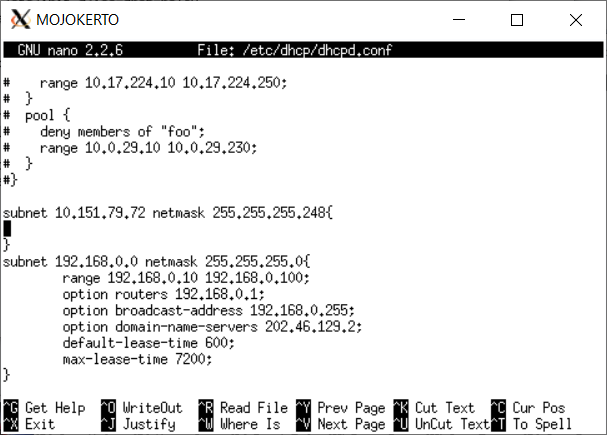
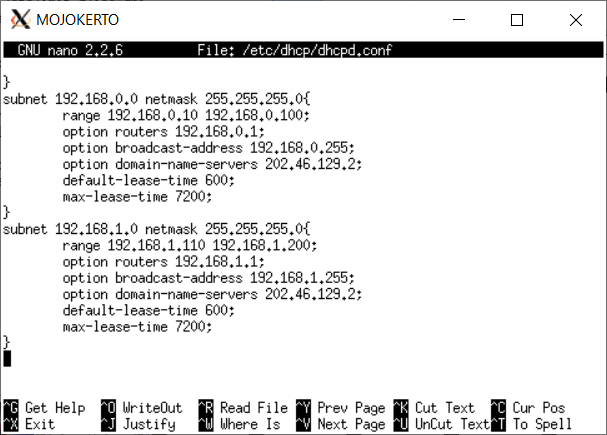
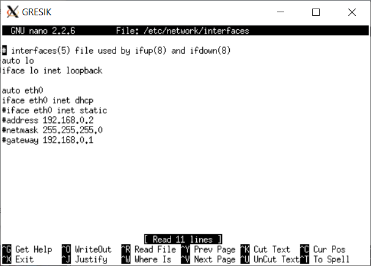
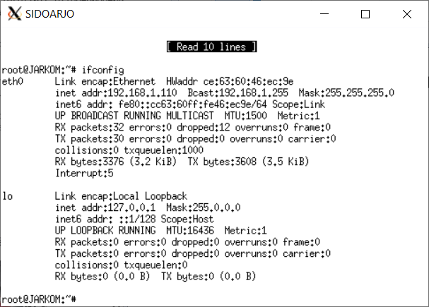
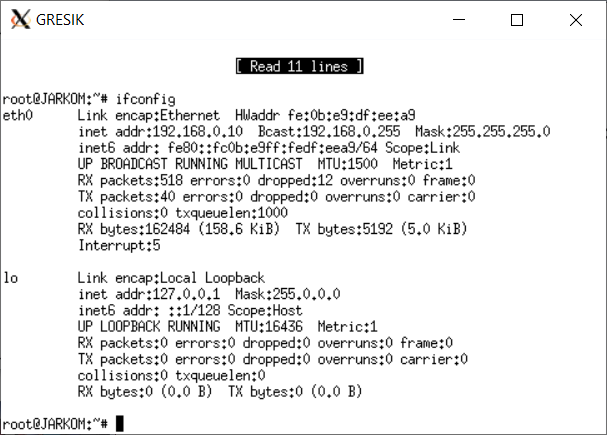

# Jarkom_Modul5_Lapres_D08

## Persiapan
#### A. Topologi
Topologi yang akan dibangun untuk soal ini adalah sbb:

#### B, C. Routing
Untuk Routing, digunakan teknik routing VLSM. VLSM table yang dihasilkan adalah sbb:

| Subnet | Jumlah IP | NID | Netmask | Range |Broadcast |
| --- | --- | --- | --- | --- | --- |
| A1 | 201 | 192.168.1.0 | 255.255.255.0 | 192.168.1.1 - 192.168.1.254 | 192.168.1.255 |
| A2 | 2 | 192.168.2.8 | 255.255.255.252 | 192.168.2.9 - 192.168.2.10 | 192.168.2.11 |
| A3 | 2 | 192.168.2.12 | 255.255.255.252 | 192.168.2.13 - 192.168.2.14 | 192.168.2.15 |
| A4 | 211 | 192.168.0.0 | 255.255.255.0 | 192.168.0.1 - 192.168.0.254 | 192.168.0.255 |
| A5 | 3 | 192.168.2.0 | 255.255.255.248 | 192.168.2.1 - 192.168.2.6 | 192.168.2.7 |

Setelah ditentukan teknik routing dan tabelnya, selanjutnya adalah melakukan konfigurasi interface di uml2 yang ada sesuai dari tabel diatas, di /etc/network/interfaces:

SIDOARJO

```
auto eth0
iface eth0 inet static
address 192.168.1.2
netmask 255.255.255.0
gateway 192.168.1.1
```

GRESIK

```
auto eth0
iface eth0 inet static
address 192.168.0.2
netmask 255.255.255.0
gateway 192.168.0.1
```

PROBOLINGGO

```
auto eth0
iface eth0 inet static
address 192.168.2.2
netmask 255.255.255.248
gateway 192.168.2.1
```


MADIUN

```
auto eth0
iface eth0 inet static
address 192.168.2.3
netmask 255.255.255.248
gateway 192.168.2.1
```

MALANG

```
auto eth0
iface eth0 inet static
address 10.151.79.74
netmask 255.255.255.248
gateway 10.151.79.73
```

MOJOKERTO

```
auto eth0
iface eth0 inet static
address 10.151.79.75
netmask 255.255.255.248
gateway 10.151.79.73
```

KEDIRI

```
auto eth0
iface eth0 inet static
address 192.168.2.14
netmask 255.255.255.252

auto eth1
iface eth1 inet static
address 192.168.0.1
netmask 255.255.255.0

auto eth2
iface eth2 inet static
address 192.168.2.1
netmask 255.255.255.248
```

BATU

```
auto eth0
iface eth0 inet static
address 192.168.2.10
netmask 255.255.255.252

auto eth1
iface eth1 inet static
address 192.168.1.1
netmask 255.255.255.0

auto eth2
iface eth2 inet static
address 10.151.79.73
netmask 255.255.255.248
```

SURABAYA

```
auto eth0
iface eth0 inet static
address 10.151.78.38
netmask 255.255.255.252
gateway 10.151.78.39

auto eth1
iface eth1 inet static
address 192.168.2.9
netmask 255.255.255.252

auto eth2
iface eth2 inet static
address 192.168.2.13
netmask 255.255.255.252
```

Setelah konfigurasi interface, dilakukan routing dengan command berikut di setiap router:

SURABAYA

```
route add -net 192.168.0.0 netmask 255.255.255.0 gw 192.168.2.14
route add -net 192.168.2.0 netmask 255.255.255.248 gw 192.168.2.14
route add -net 192.168.1.0 netmask 255.255.255.0 gw 192.168.2.10
route add -net 10.151.79.72 netmask 255.255.255.248 gw 192.168.2.10
```

KEDIRI

```
route add -net 0.0.0.0 netmask 0.0.0.0 gw 192.168.2.13
```

BATU

```
route add -net 0.0.0.0 netmask 0.0.0.0 gw 192.168.2.9
```

Karena routing ikut hilang ketika restart network, maka command routing untuk dimasukkan ke dalam route.sh di setiap uml agar mudah untuk dieksekusi setelah restart network

#### D. DHCP
Untuk mengatur client SIDOARJO dan GRESIK agar memiliki IP dinamis, maka dipakai DHCP
DHCP server ini akan terletak di MOJOKERTO, sedangkan DHCP relay ini adalah semua router yang terlibat yang menghubungkan client SIDOARJO dan GRESIK ke MOJOKERTO, yaitu router BATU untuk SIDORAJO-MOJOKERTO, dan router BATU, SURABAYA, dan KEDIRI untuk GRESIK-MOJOKERTO.

Langkah pertama adalah menginstall isc-dhcp-server di MOJOKERTO:

```
apt-get install isc-dhcp-server
```

dan selanjutnya adalah menginstall isc-dhcp-relay di router SURABAYA, BATU, dan KEDIRI:

```
apt-get install isc-dhcp-relay
```

Saat menginstall DHCP relay, akan muncul layar untuk memasukkan server yang dibutuhkan dan interface. Server diisi dengan IP MOJOKERTO (10.151.79.75), dan interface dimasukkan sebagai berikut:
- eth0, eth1, eth2 di BATU



- eth1, eth2 di SURABAYA



- eth0, eth1 di KEDIRI



Interface yang dimasukkan dipisahkan dengan spasi. Konfigurasi ini nantinya juga bisa diedit di /etc/default/isc-dhcp-relay di masing2 router.
Selanjutnya adalah mengkonfigurasi DHCP server MOJOKERTO di /etc/default/isc-dhcp-server. Di baris akhir interface, diisi eth0:



Selanjutnya adalah melakukan setting untuk client2 yang terhubung ke DHCP server, di /etc/dhcp/dhcpd.conf:




Setelah dilakukan semua set up tadi, dilakukan command berikut:
- Untuk DHCP server MOJOKERTO, dilakukan command ```service isc-dhcp-server restart``` untuk merestart DHCP server
- Untuk DHCP relay, dilakukan command ```service isc-dhcp-relay restart``` untuk merestart DHCP relay
Jika ada fail, dapat restart dapat diganti dengan stop lalu start untuk merestart.

Selanjutnya adalah konfigurasi interface di SIDOARJO dan GRESIK di /etc/network/interfaces.
Semua line dibawah ```auto eth0``` dicomment (#), dan dibawahnya ditambah dengan line berikut:

```
iface eth0 inet dhcp
```

untuk menhubungkan kedua client dengan DHCP server.




Setelah dihubungkan, di kedua client dilakukan ```service networking restart``` untuk merestart network. Client akan terhubung ke DHCP server untuk pertama kali restart. Jika client tidak mendapat IP pinjaman DHCP server setelah restart, maka dapat dilakukan restart ulang untuk mendapat IP baru:




## Soal
#### Soal 1
#### Soal 2
#### Soal 3
#### Soal 4
#### Soal 5
#### Soal 6
#### Soal 7
